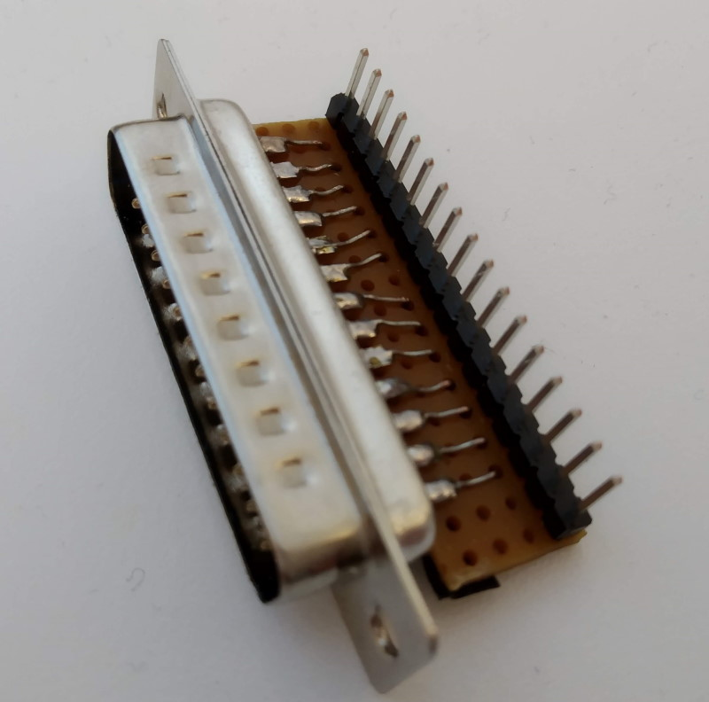
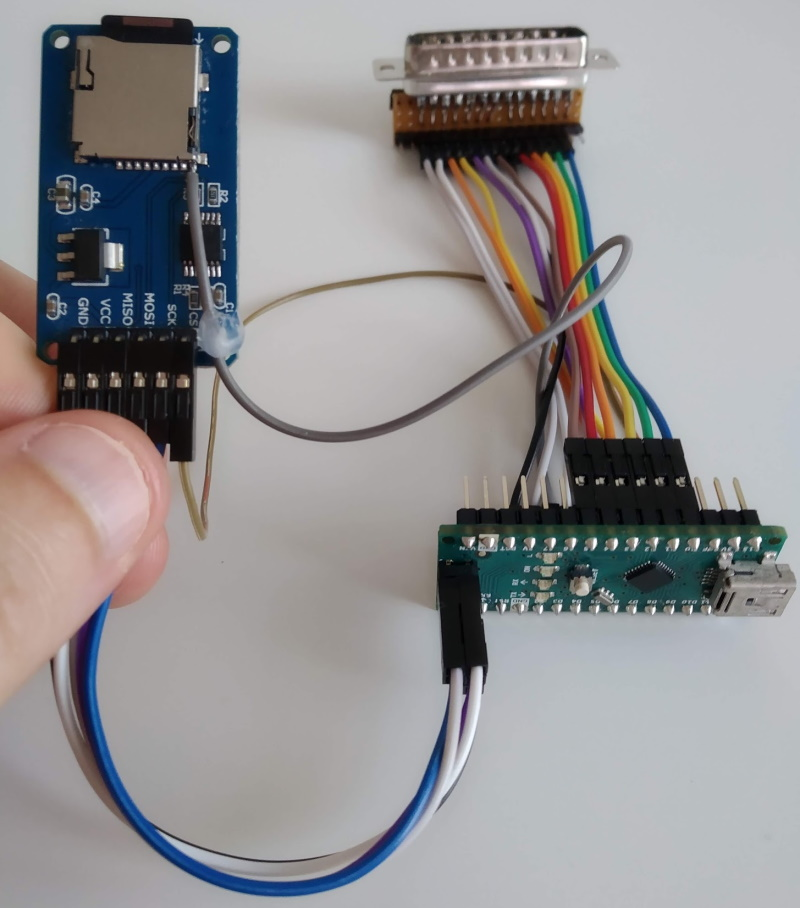
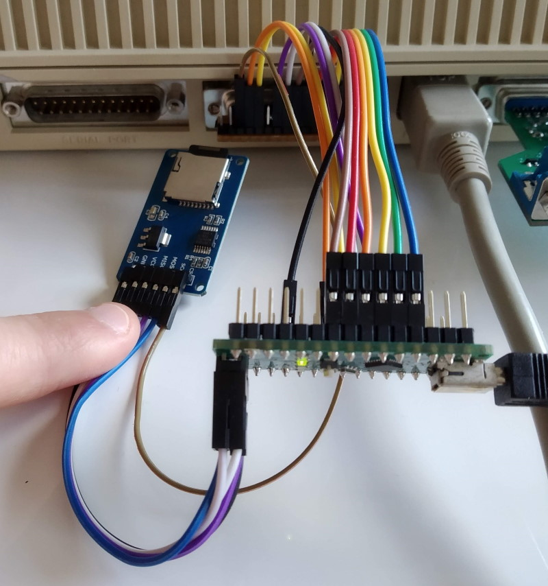
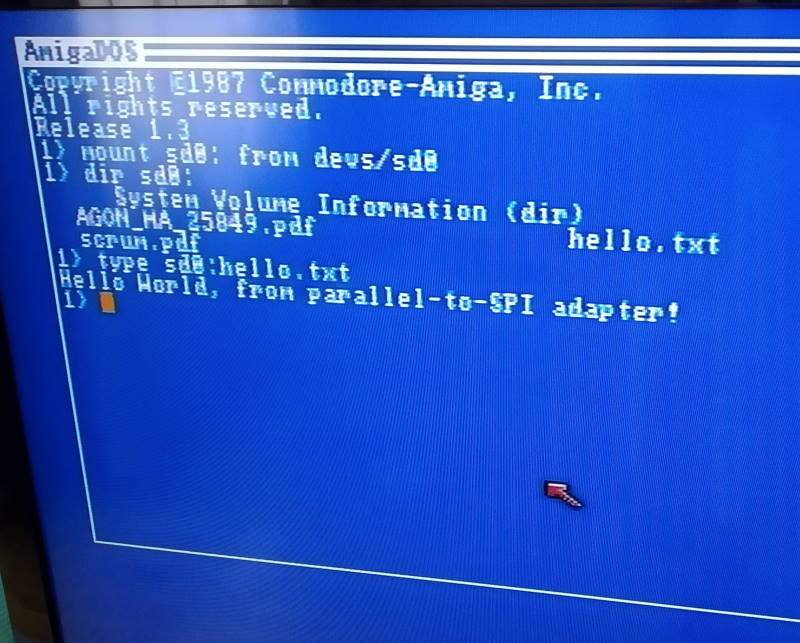

# Amiga Parallel Port to SPI Adapter

The goal of this project is to make a cheap and easy to build SPI adapter that connects to the parallel port of an Amiga. Furthermore, the performance of the adapter should be as fast as possible.

## Please note: new hardware incompatible version!

What you are looking at is a new version of this design. It is hardware
incompatible with the original version. Updating the software without making
the corresponding hardware changes will not work.

Old versions of this design are available as tags/releases.

### Changes with latest version

Support has been added that allows the SPI device to interrupt the Amiga via the adapter.
The SD card example driver has been modified to use this interrupt so that the SD card
can be inserted/ejected as part of normal operations.

A video demonstrating this can be seen here: https://www.youtube.com/watch?v=zJDtiFQgrn0.

## What parts make up the project?

- An AVR microcontroller, provided by an Arduino Nano board
- A parallel port connector that connects to the AVR
- [Instructions](hardware/assembly-instructions.md) for how to assemble the above
- [Code](avr) for the AVR that waits to receive commands from the Amiga, and executes those commands
- A source code library for the Amiga, [*spi-lib*](spi-lib), that communicates with the AVR
- An [example](examples/spisd) of how to use the adapter to connect to an SD card module

|         |            |
| ------------- |---------------|
|  |  |
| |  |

See the [assembly instructions](hardware/assembly-instructions.md) for how to connect the parts together.

## What can it be used for?

There exists many SPI peripherals that can be connected to this adapter.
The SPI adapter comes with a source code library, spi-lib, that is used to perform reads and writes to the SPI peripheral.
For each kind of SPI peripheral, however, a separate driver needs to be written that uses spi-lib, and exposes the functionality of the SPI peripheral to the operating system using some suitable interface.

In the directory [examples/spisd](examples/spisd) an example of how an SD card module can be connected to the SPI adapter, and a driver is provided that lets AmigaOS mount the SPI card as a file system.

## Performance

The throughput of the adapter is limited by how fast the 68k CPU can access the CIA chips.
The CPU can make one access (a read or a write) to a CIA chip per E-cycle.
An E-cycle is one tenth of the frequency of an original Amiga.
The E-cycle frequency is thus roughly 700 kHz, regardless if the Amiga uses an accelerator or not.
The protocol used by the SPI adapter can communicate one byte every two E-cycles which gives a theoretical upper
limit of 350 kB/s.

I performed a simple benchmark on an A500 with an HC508 accelerator, and an SD card module connected to the SPI adapter.
Copying a 23 MB file from the SD card to the compact flash in the HC508 took 98 seconds, giving a throughput of 225 kB/s.
I think this is a good result, and I believe it will be hard to come much closer to the theoretical limit of 350 kB/s.

There are however some optimizations that could be implemented, such as transfering more than one sector (512 bytes) at a time from the SD card, that could make the throughput come closer to the limit.
